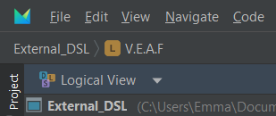
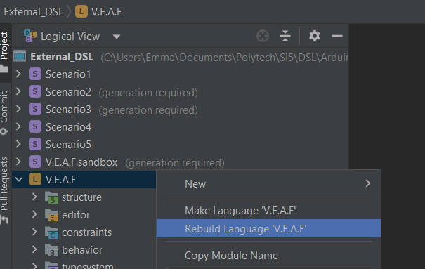
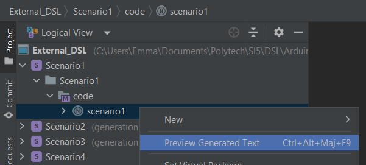
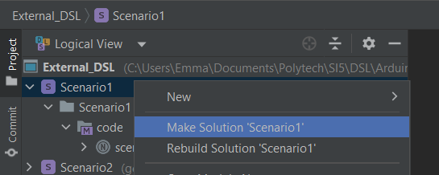

# DSL_Team_Pancake

## Team members
* Laurie FERNANDEZ
* Emma GLESSER
* Arthur SOENS
* Vincent TUREL

## Internal DSL

Our internal DSL was made using Groovy, you can find it in the Internal_DSL folder of the project.

### How to build

In the Internal_DSL folder, use the script `build.sh` to get a Jar of our DSL located in its `/target` folder.

### How to use it

Use the Internal_DSL folder's `run.sh` script giving as argument the input program. The corresponding `.ino` file will be generated in the `result` folder.

## External DSL

This is our internal DSL made using MPS.  
All our files used to make our external DSL are in the External_DSL directory.

### How to build
- Install MPS : https://www.jetbrains.com/fr-fr/mps/
- Open the project and choose "Logical View"  
    
- Make or rebuild the language VEAF  
    

### How to use
#### Preview generated code
- Preview the generated text  
    
- Copy and paste the generated code into an Arduino IDE

#### Generate the .ino file
- Make the solution  
    
- Search the file corresponding to the given program name
    - `DSL_Team_Pancake\External_DSL\solutions\Scenario1\source_gen\Scenario1\code\scenario1.ino`
    - `.\solutions\Scenario1\source_gen\Scenario1\code\scenario1.ino` (if you are in External_DSL directory)
- Open the .ino file with an Arduino IDE 